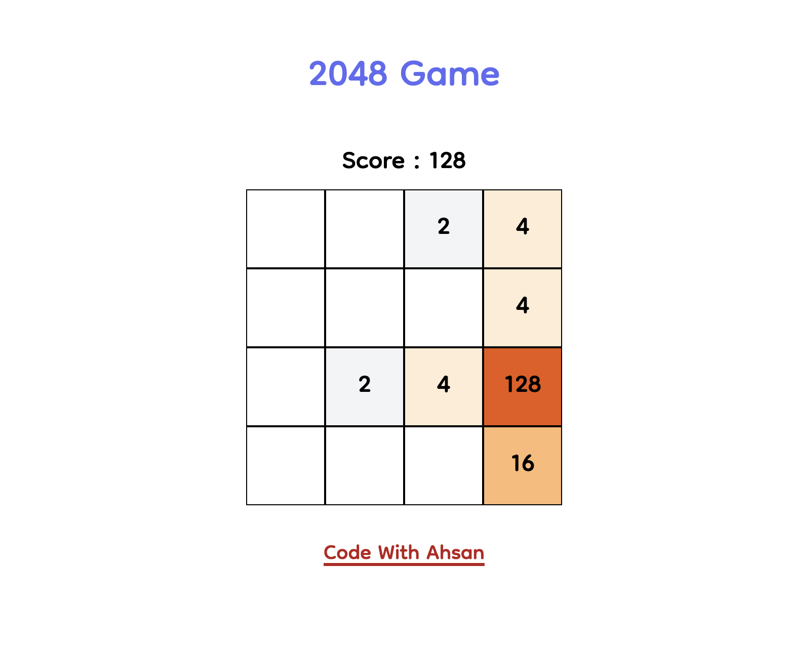

# ng-2048

## About the game
A new rendition of the classic [2048 game](https://play2048.co/) using Angular, Typescript, Tailwind CSS and a bit of 💗

## Demo
<a href="https://code-with-ahsan.github.io/ng-2048">
https://code-with-ahsan.github.io/ng-2048
</a>

 

 

## Try Locally

Clone the repository first. Then install the package dependencies using npm or yarn.

Then run `ng serve` for a dev server. Navigate to `http://localhost:4200/`. The app will automatically reload if you change any of the source files.

## About me

  

    I'm a Software Architect working at <a href="https://www.syncron.com/">Syncron</a> and a <a href="https://ahsanayaz.com/gde">Google Developers Expert in Angular</a>. I create video tutorials on <a href="https://ahsanayaz.com/youtube">YouTube</a> and write articles at my blog <a href="https://ahsanayaz.com">https://ahsanayaz.com</a>. 
  

<h4 style="margin-bottom: 0">Like my work? </h4>

Or follow & connect with me on my Socials:

